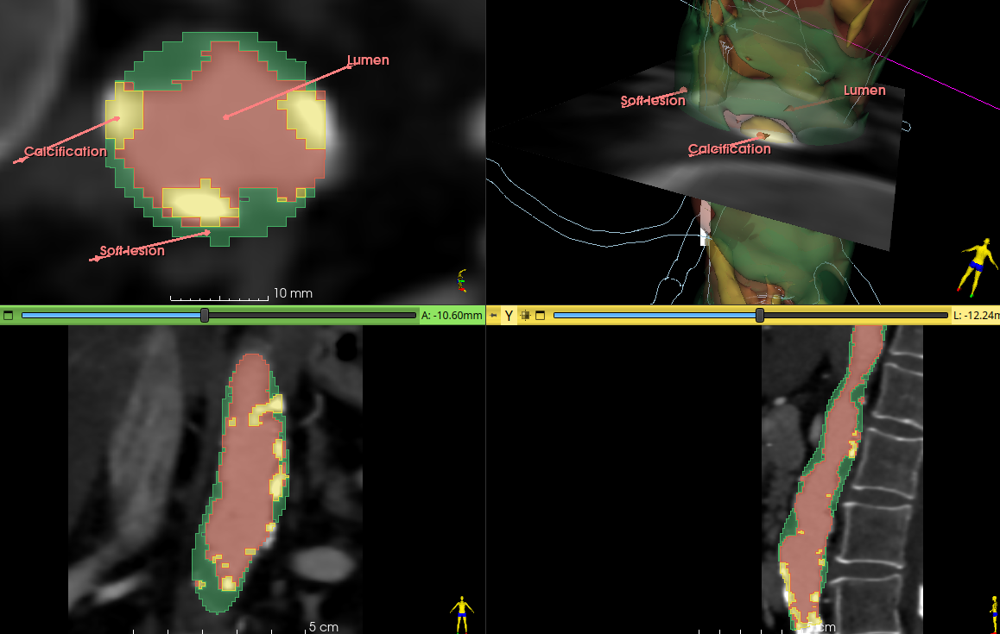

# Artery parts segmentation

This module segments a contrasted artery in three parts inside a [Shape](https://github.com/chir-set/SlicerExtraMarkups)::Tube node.

It creates lumen, calcification and soft lesion segments from a *diseased* artery on CT angiogram.

### Usage

Select a Shape::Tube node and a scalar volume of a CT angiogram. Click preview, focus the slice views on the flashing preview and move the slider bar buttons to threshold the artery's lumen. Optionally, specify if the artery is severely diseased. Finally apply.

### Notes

This is intended for highlighting components of diseased arteries. Segmentation of healthy arteries, without any single lesion, is faster with anyone's preferred method. Likewise, if only the lumen of a diseased artery is required, this module won't bring much more.

Finally, the result may be unusable sometimes.

### Disclaimer

Use at your own risks.

