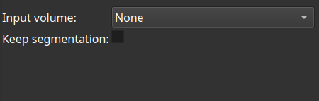

# Body isolation

This module isolates the body in common CT scans.

These must be headless, with a complete skin circumference along the Z-axis.

### Usage

Select a scalar volume node and apply. The result will be a volume with the best extraction of the body from its surroundings.

Optionally, keep the processing segmentation with a segment of the body.

### Notes

A cropped input volume must not contain any air exposure on any side.

### Disclaimer

Use at your own risks.
