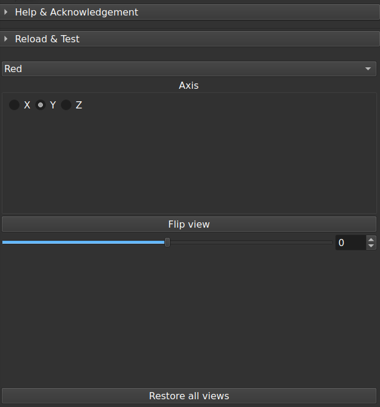

# FlipViewPoint module

This [Slicer](https://www.slicer.org/) module flips 2D viewpoints.

**Usage**

Selecting a slice view and an axis of rotation.

Either flip the slice view by 180°, or rotate by any angle.

**Disclaimer**

Use at your own risks.
