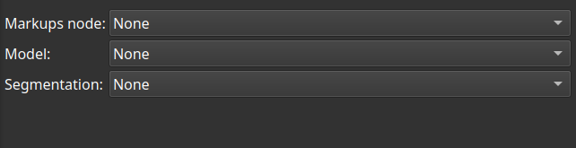

# Markups to surface

This module creates models and segments from markups nodes.

It is restricted to these markups types : ROI, Shape and Fiducial.

A markups fiducial node as input is a [special](https://discourse.slicer.org/t/how-i-can-find-the-center-of-the-humeroulnar-joint-using-3d-slicer/27779) case, where a best-fit sphere is created from a cloud of points, using [this](https://github.com/thompson318/scikit-surgery-sphere-fitting/blob/master/sksurgeryspherefitting/algorithms/sphere_fitting.py) algorithm.

### Usage

Select an input node, and at least a model and/or a segmentation output node. Apply.

### Notes

For the [Shape](https://github.com/chir-set/SlicerExtraMarkups)::Ring and Shape::Disk node, a created segment will vanish if 3D display is switched On/Off/On. This is expected.

### Disclaimer

Use at your own risk.

