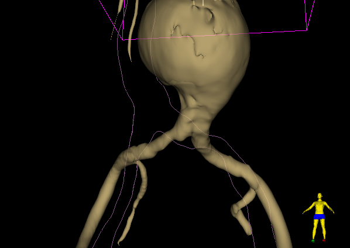

# Silhouette

This module creates an outline of a segment.

It is a simple use case of [vtkPolyDataSilhouette](https://vtk.org/doc/nightly/html/classvtkPolyDataSilhouette.html). The created model is updated with the default camera of the first 3D view.

### Usage

Select a segment and apply.

If an existing output model is provided, it is reset and overwritten.

### Disclaimer

Use at your own risks.
