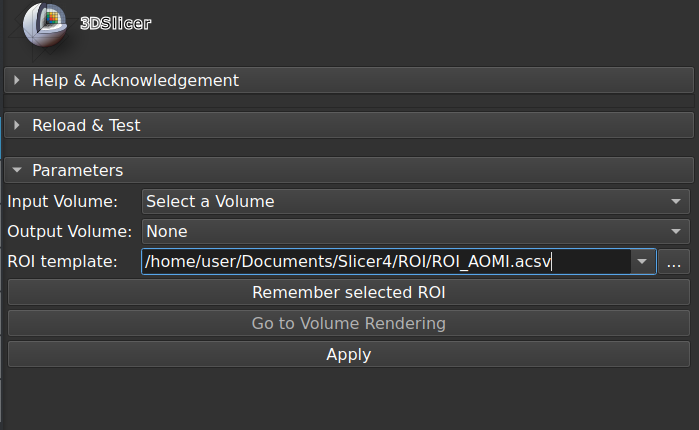

# TemplateROICrop
A custom [Slicer](https://www.slicer.org/) module to crop volumes based on template ROIs.

**Usage**

Create an ROI and save it on disk.
Navigate to the saved ROI using the 'ROI template' widget. Use the 'Remember selected ROI' to append it to the list.
Select an input volume and apply.

**Comments**

Designed to save time when cropping same body regions on CT scans. Revert to manual cropping if unexpected results.

*To delete items, edit $HOME/.config/NA-MIC/Slicer.ini @[ctkPathLineEdit].*

**Disclaimer**

Use at your own risks.